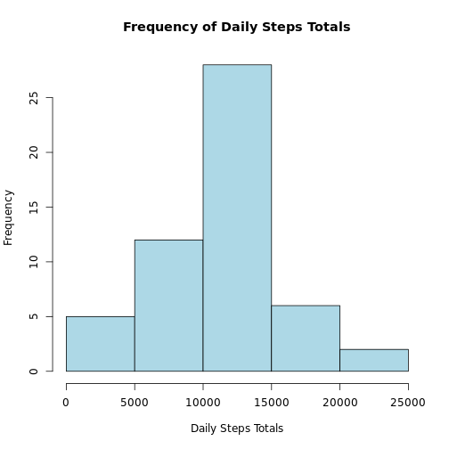
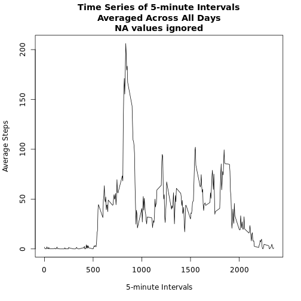
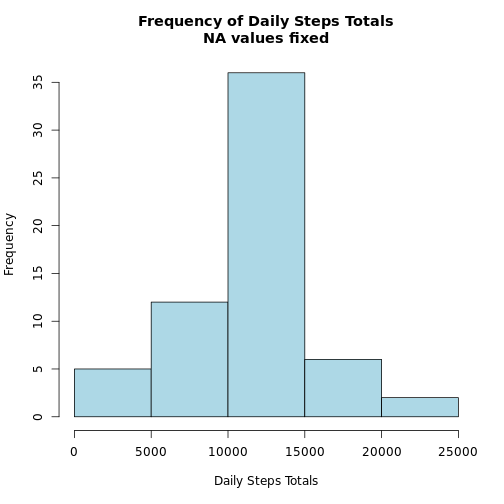
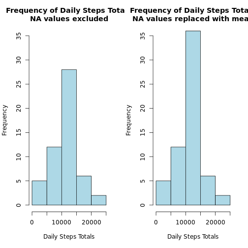
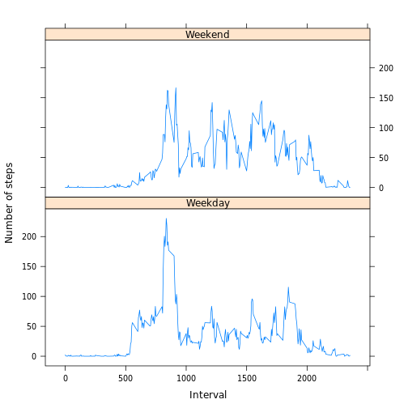

## Loading and preprocessing the data
Download and unzip the file.


```r
download.file("https://d396qusza40orc.cloudfront.net/repdata%2Fdata%2Factivity.zip", "amdata.zip")
unzip("amdata.zip")
```

Read in the csv file, making sure to specify how NA values are represented in the data.


```r
amdata <- read.csv("activity.csv", na.strings = "NA")
```

Let's modify the date field so that it is a Date object.


```r
amdata$date <- as.Date(amdata$date, format = "%Y-%m-%d")
```

## What is mean total number of steps taken per day?

How many steps were taken each day, ignoring NA values?


```r
daily_steps <- aggregate(formula = steps~date, data = amdata, FUN = sum)
head(daily_steps)
```

```
##         date steps
## 1 2012-10-02   126
## 2 2012-10-03 11352
## 3 2012-10-04 12116
## 4 2012-10-05 13294
## 5 2012-10-06 15420
## 6 2012-10-07 11015
```

Great. Let's plot a histogram of the daily step totals.


```r
hist(daily_steps$steps, main = "Frequency of Daily Steps Totals", xlab = "Daily Steps Totals", col = "light blue")
```



Let's calculate the mean and median of the of the total number of steps taken per day, ignoring NA values.


```r
mean(daily_steps$steps, na.rm = TRUE)
```

```
## [1] 10766.19
```

```r
median(daily_steps$steps, na.rm = TRUE)
```

```
## [1] 10765
```


## What is the average daily activity pattern?
Instead of daily totals, let's take a look at what an average day looks like in detail. 

First, for each 5-minute interval we need the average number of steps taken in that interval across all the days in the dataset. Let's also rename the steps variable to stepsmean.

```r
interval_steps_mean <- aggregate(formula = steps ~ interval, data = amdata, FUN = mean)
colnames(interval_steps_mean) <- c("interval","stepsmean")
```

Now we can plot a time series of the 5-minute intervals to see what the average day looked like.


```r
plot(y = interval_steps_mean$steps, 
     x = interval_steps_mean$interval, 
     type = "l", 
     xlab = "5-minute Intervals", 
     ylab = "Average Steps", 
     main = "Time Series of 5-minute Intervals\nAveraged Across All Days\nNA values ignored")
```



On average, which 5-minute interval had the most steps?


```r
order_desc <- order(interval_steps_mean$steps, decreasing = TRUE)
interval_steps_mean <- interval_steps_mean[order_desc, ]
interval_steps_mean[1, ]
```

```
##     interval stepsmean
## 104      835  206.1698
```

## Imputing missing values
How many missing values are in the dataset?


```r
nrow(amdata[is.na(amdata$steps),])
```

```
## [1] 2304
```

One way to fix the missing values within the dataset is to set each NA value to be the average value for the given 5-minute interval. Here is one way to do that.


```r
amdata_na_fixed <- merge(amdata,interval_steps_mean)
amdata_na_fixed$steps <- with(amdata_na_fixed, ifelse(is.na(steps), stepsmean, steps))
```

Now let's recalculate the total number of steps each day using the dataset with NA values fixed.

```r
daily_steps_na_fixed <- aggregate(formula = steps~date, data = amdata_na_fixed, FUN = sum)
```

Great. Let's plot a histogram of the daily step totals with NA values fixed.


```r
hist(daily_steps_na_fixed$steps, main = "Frequency of Daily Steps Totals\nNA values fixed", xlab = "Daily Steps Totals", col = "light blue")
```



How does this compare to the histogram without the NA values fixed?


```r
par(mfcol = c(1,2))
hist(daily_steps$steps, main = "Frequency of Daily Steps Totals\nNA values excluded", xlab = "Daily Steps Totals", col = "light blue", ylim = c(0,35))
hist(daily_steps_na_fixed$steps, main = "Frequency of Daily Steps Totals\nNA values replaced with mean", xlab = "Daily Steps Totals", col = "light blue", ylim = c(0,35))
```



Let's again calculate the mean and median of the of the total number of steps taken per day, this time with NA values fixed.


```r
mean(daily_steps_na_fixed$steps)
```

```
## [1] 10766.19
```

```r
median(daily_steps_na_fixed$steps)
```

```
## [1] 10766.19
```

By comparing the mean values, you can confirm that the mean steps taken each day has not changed. Given that we set NA values to be the mean values for the respective intervals, this makes sense. 

A consequence of replacing a large number of NA values with mean values is that there is an abundance of values equal to the mean. As a result, the median value in the fixed dataset is equal to the mean value.

## Are there differences in activity patterns between weekdays and weekends?

To help with this, we need an easy way to determine if a given day is a weekday or a weekend. One way to do this is with a small function:


```r
daytype <- function(x) { 
  ifelse(x %in% c("Saturday", "Sunday"), "Weekend", "Weekday")
}
```

With this in place, we can use the weekdays() function to add a new factor variable to our data set.


```r
amdata_na_fixed$daytype <- factor(daytype(weekdays(amdata_na_fixed$date)))
```

Now we can calculate the average 5-minute interval step values for Weekend and Weekday days.


```r
interval_steps_weeksplit_mean <- aggregate(formula = steps ~ interval + daytype, data = amdata_na_fixed, FUN = mean)
```

Now we can plot the Weekend and Weekday data for average 5-minute intervals.


```r
library(lattice)
with(interval_steps_weeksplit_mean, xyplot(steps ~ interval | daytype, 
       main = "", 
       ylab = "Number of steps", 
       xlab = "Interval", 
       layout = c(1,2), 
       type = "l"))
```


